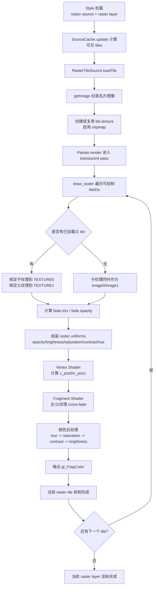

# 当前仓库 Raster 瓦片渲染实现说明

## 1. 模块入口与职责

1. `raster` 源类型在 Source 工厂里注册，`type: "raster"` 会实例化 `RasterTileSource`。  
[source/source.js:96](D:/学习仓库/mapbox-gl-source/new-mapbox-gl-v1/source/source.js:96)  
[source/source.js:116](D:/学习仓库/mapbox-gl-source/new-mapbox-gl-v1/source/source.js:116)

2. `raster` 图层类型在 style layer 工厂里注册，实例是 `RasterStyleLayer`。  
[style/create_style_layer.js:17](D:/学习仓库/mapbox-gl-source/new-mapbox-gl-v1/style/create_style_layer.js:17)  
[style/create_style_layer.js:29](D:/学习仓库/mapbox-gl-source/new-mapbox-gl-v1/style/create_style_layer.js:29)  
[style/style_layer/raster_style_layer.js:11](D:/学习仓库/mapbox-gl-source/new-mapbox-gl-v1/style/style_layer/raster_style_layer.js:11)

3. `Painter` 的 `draw` 分发表把 `raster` 类型映射到 `draw_raster`。  
[render/painter.js:40](D:/学习仓库/mapbox-gl-source/new-mapbox-gl-v1/render/painter.js:40)  
[render/painter.js:48](D:/学习仓库/mapbox-gl-source/new-mapbox-gl-v1/render/painter.js:48)

---

## 2. Raster 瓦片加载流程（CPU 侧）

1. `RasterTileSource.onAdd()` 调用 `load()`，先加载 TileJSON（或直接使用内联配置），并得到 `tiles/minzoom/maxzoom/tileSize/bounds` 等元数据。  
[source/raster_tile_source.js:64](D:/学习仓库/mapbox-gl-source/new-mapbox-gl-v1/source/raster_tile_source.js:64)  
[source/load_tilejson.js:13](D:/学习仓库/mapbox-gl-source/new-mapbox-gl-v1/source/load_tilejson.js:13)  
[source/load_tilejson.js:21](D:/学习仓库/mapbox-gl-source/new-mapbox-gl-v1/source/load_tilejson.js:21)

2. 每帧 `SourceCache.update()` 基于视口计算理想 tile 集合，并对 raster 类型额外做“父子 tile 保留 + 淡入淡出”相关保留策略。  
[source/source_cache.js:474](D:/学习仓库/mapbox-gl-source/new-mapbox-gl-v1/source/source_cache.js:474)  
[source/source_cache.js:515](D:/学习仓库/mapbox-gl-source/new-mapbox-gl-v1/source/source_cache.js:515)  
[source/source_cache.js:377](D:/学习仓库/mapbox-gl-source/new-mapbox-gl-v1/source/source_cache.js:377)

3. 新 tile 进入时，`RasterTileSource.loadTile()` 生成 URL 并调用 `getImage()` 拉取图片；`getImage()` 内部有并发上限队列。  
[source/raster_tile_source.js:112](D:/学习仓库/mapbox-gl-source/new-mapbox-gl-v1/source/raster_tile_source.js:112)  
[source/raster_tile_source.js:113](D:/学习仓库/mapbox-gl-source/new-mapbox-gl-v1/source/raster_tile_source.js:113)  
[util/ajax.js:307](D:/学习仓库/mapbox-gl-source/new-mapbox-gl-v1/util/ajax.js:307)  
[util/ajax.js:316](D:/学习仓库/mapbox-gl-source/new-mapbox-gl-v1/util/ajax.js:316)

4. 图片加载后创建/复用 `tile.texture`（WebGL texture），并启用 mipmap；卸载时回收到 painter 纹理池复用。  
[source/raster_tile_source.js:134](D:/学习仓库/mapbox-gl-source/new-mapbox-gl-v1/source/raster_tile_source.js:134)  
[source/raster_tile_source.js:160](D:/学习仓库/mapbox-gl-source/new-mapbox-gl-v1/source/raster_tile_source.js:160)

---

## 3. 渲染调度与可绘制集合

1. `Painter.render()` 中先 `sourceCache.prepare()`，再拿 `getVisibleCoordinates()`，最后按图层类型调用 `draw_raster`。  
[render/painter.js:357](D:/学习仓库/mapbox-gl-source/new-mapbox-gl-v1/render/painter.js:357)  
[source/source_cache.js:858](D:/学习仓库/mapbox-gl-source/new-mapbox-gl-v1/source/source_cache.js:858)  
[render/painter.js:484](D:/学习仓库/mapbox-gl-source/new-mapbox-gl-v1/render/painter.js:484)

2. `drawRaster()` 只在 `translucent` pass 绘制，并跳过 `raster-opacity=0` 或空 tile 列表。  
[render/draw_raster.js:19](D:/学习仓库/mapbox-gl-source/new-mapbox-gl-v1/render/draw_raster.js:19)  
[render/draw_raster.js:20](D:/学习仓库/mapbox-gl-source/new-mapbox-gl-v1/render/draw_raster.js:20)  
[render/draw_raster.js:21](D:/学习仓库/mapbox-gl-source/new-mapbox-gl-v1/render/draw_raster.js:21)

3. raster 图层默认不走 tile clipping（`StyleLayer.isTileClipped()` 默认 `false`），而是通过 `stencilConfigForOverlap` 处理不同缩放级别 tile 的覆盖关系，防止重叠区域重复绘制。  
[style/style_layer.js:255](D:/学习仓库/mapbox-gl-source/new-mapbox-gl-v1/style/style_layer.js:255)  
[render/painter.js:306](D:/学习仓库/mapbox-gl-source/new-mapbox-gl-v1/render/painter.js:306)  
[render/draw_raster.js:32](D:/学习仓库/mapbox-gl-source/new-mapbox-gl-v1/render/draw_raster.js:32)

---

## 4. 跨层级淡入淡出（Cross-fade）

1. 每个 tile 在绘制时注册 `fadeEndTime`。  
[source/tile.js:117](D:/学习仓库/mapbox-gl-source/new-mapbox-gl-v1/source/tile.js:117)

2. `draw_raster` 会找已加载父 tile，并在纹理单元 `0/1` 绑定“子图/父图”，计算 `fade.mix` 和 `fade.opacity`。  
[render/draw_raster.js:49](D:/学习仓库/mapbox-gl-source/new-mapbox-gl-v1/render/draw_raster.js:49)  
[render/draw_raster.js:69](D:/学习仓库/mapbox-gl-source/new-mapbox-gl-v1/render/draw_raster.js:69)  
[render/draw_raster.js:83](D:/学习仓库/mapbox-gl-source/new-mapbox-gl-v1/render/draw_raster.js:83)

3. `SourceCache.hasTransition()` 对 raster 会检查 `fadeEndTime`，确保过渡期间持续重绘。  
[source/source_cache.js:866](D:/学习仓库/mapbox-gl-source/new-mapbox-gl-v1/source/source_cache.js:866)

---

## 5. GPU 数据与 Shader 计算

1. 顶点布局是 `a_pos + a_texture_pos`，都为 `Int16`。  
[data/raster_bounds_attributes.js:4](D:/学习仓库/mapbox-gl-source/new-mapbox-gl-v1/data/raster_bounds_attributes.js:4)

2. painter 初始化了通用 raster 四边形缓冲（4 顶点 + 2 三角形）。  
[render/painter.js:181](D:/学习仓库/mapbox-gl-source/new-mapbox-gl-v1/render/painter.js:181)  
[render/painter.js:186](D:/学习仓库/mapbox-gl-source/new-mapbox-gl-v1/render/painter.js:186)

3. `raster` program 的 uniforms 在 `raster_program` 定义，包括 opacity/brightness/saturation/contrast/hue-rotate。  
[render/program/raster_program.js:31](D:/学习仓库/mapbox-gl-source/new-mapbox-gl-v1/render/program/raster_program.js:31)  
[render/program/raster_program.js:47](D:/学习仓库/mapbox-gl-source/new-mapbox-gl-v1/render/program/raster_program.js:47)

4. 顶点着色器计算主纹理坐标 `v_pos0` 和父纹理坐标 `v_pos1`。  
[shaders/raster.vertex.glsl:13](D:/学习仓库/mapbox-gl-source/new-mapbox-gl-v1/shaders/raster.vertex.glsl:13)  
[shaders/raster.vertex.glsl:19](D:/学习仓库/mapbox-gl-source/new-mapbox-gl-v1/shaders/raster.vertex.glsl:19)

5. 片元着色器先混合主/父纹理，再做 hue/saturation/contrast/brightness 调整，输出最终颜色。  
[shaders/raster.fragment.glsl:18](D:/学习仓库/mapbox-gl-source/new-mapbox-gl-v1/shaders/raster.fragment.glsl:18)  
[shaders/raster.fragment.glsl:26](D:/学习仓库/mapbox-gl-source/new-mapbox-gl-v1/shaders/raster.fragment.glsl:26)  
[shaders/raster.fragment.glsl:47](D:/学习仓库/mapbox-gl-source/new-mapbox-gl-v1/shaders/raster.fragment.glsl:47)

---

## 6. 样式属性如何影响渲染

1. raster paint 属性全部是 `DataConstantProperty`，包括：  
`raster-opacity / raster-hue-rotate / raster-brightness-min / raster-brightness-max / raster-saturation / raster-contrast / raster-resampling / raster-fade-duration`。  
[style/style_layer/raster_style_layer_properties.js:23](D:/学习仓库/mapbox-gl-source/new-mapbox-gl-v1/style/style_layer/raster_style_layer_properties.js:23)

2. `raster-resampling` 决定采样器过滤模式（`nearest` 或 `linear`）。  
[render/draw_raster.js:53](D:/学习仓库/mapbox-gl-source/new-mapbox-gl-v1/render/draw_raster.js:53)

3. 这些属性在 `rasterUniformValues()` 里转成 GPU uniform，其中饱和度/对比度/色相旋转会先转换为 shader 使用的系数。  
[render/program/raster_program.js:59](D:/学习仓库/mapbox-gl-source/new-mapbox-gl-v1/render/program/raster_program.js:59)  
[render/program/raster_program.js:69](D:/学习仓库/mapbox-gl-source/new-mapbox-gl-v1/render/program/raster_program.js:69)

---

## 7. 与 image/video/canvas 的关系

1. `SourceCache` 将 `raster/image/video` 统一视作 raster 类型处理（尤其是过渡逻辑）。  
[source/source_cache.js:949](D:/学习仓库/mapbox-gl-source/new-mapbox-gl-v1/source/source_cache.js:949)

2. `draw_raster` 对 `ImageSource` 走单独分支，使用 source 自己的 `boundsBuffer/boundsSegments`，但仍使用同一套 raster shader。  
[render/draw_raster.js:32](D:/学习仓库/mapbox-gl-source/new-mapbox-gl-v1/render/draw_raster.js:32)  
[render/draw_raster.js:71](D:/学习仓库/mapbox-gl-source/new-mapbox-gl-v1/render/draw_raster.js:71)

---

## 8. 一句话调用链

`Style(JSON)` -> `createSource(raster)` -> `RasterTileSource.loadTile(getImage -> Texture)` -> `SourceCache.update(保留理想/父/子 tiles)` -> `Painter.render(translucent)` -> `draw_raster(绑定 child/parent 纹理 + uniforms)` -> `raster vertex/fragment shader 输出像素`。

## 9. Raster 渲染流程图（Mermaid）

