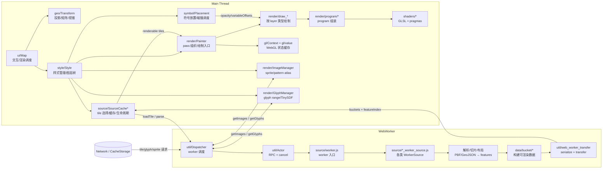

# 系统架构图（Mermaid，高层级）

```mermaid
flowchart LR
  %% High-level architecture (Mapbox GL JS v1 style)

  subgraph MainThread[Main Thread]
    Map[ui/Map<br/>交互/渲染调度] --> Transform[geo/Transform<br/>投影/矩阵/视锥]
    Map --> Style[style/Style<br/>样式管理/图层树]

    Style --> SourceCaches[source/SourceCache*<br/>tile 选择/缓存/生命周期]
    Style --> Placement[symbol/Placement<br/>符号放置/碰撞调度]
    Style --> Painter[render/Painter<br/>pass 组织/绘制入口]

    Painter --> Draw[render/draw_*<br/>按 layer 类型绘制]
    Draw --> Program[render/program/*<br/>program 组装]
    Program --> Shaders[shaders/*<br/>GLSL + pragmas]
    Painter --> GL[gl/Context + gl/value<br/>WebGL 状态缓存]

    Style --> ImageManager[render/ImageManager<br/>sprite/pattern atlas]
    Style --> GlyphManager[render/GlyphManager<br/>glyph range/TinySDF]
  end

  subgraph Worker[WebWorker]
    Dispatcher[util/Dispatcher<br/>worker 调度] --> Actor[util/Actor<br/>RPC + cancel]
    Actor --> WorkerEntry[source/worker.js<br/>worker 入口]
    WorkerEntry --> WorkerSources[source/*_worker_source.js<br/>各类 WorkerSource]
    WorkerSources --> Parse[解析/切片/布局<br/>PBF/GeoJSON → features]
    Parse --> Buckets[data/bucket/*<br/>构建可渲染数据]
    Buckets --> Transfer[util/web_worker_transfer<br/>serialize + transfer]
  end

  %% Main ↔ Worker data flow
  SourceCaches -->|loadTile / parse| Dispatcher
  Transfer -->|buckets + featureIndex| SourceCaches

  %% Rendering flow
  SourceCaches -->|renderable tiles| Painter
  Placement -->|opacity/variableOffsets| Draw

  %% Resource requests (conceptual)
  Net[(Network / CacheStorage)] -->|tile/glyph/sprite 请求| Dispatcher
  Dispatcher <-->|getImages / getGlyphs| ImageManager
  Dispatcher <-->|getImages / getGlyphs| GlyphManager
```

